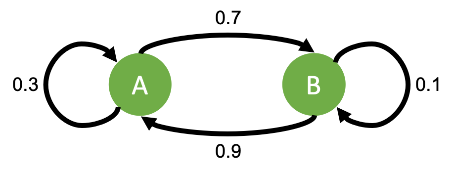

# Unsupervised Learning {#unsup_learn}
## Introduction to unsupervised learning
Unsupervised machine learning is arguably a more difficult task as the classifications are not known *a priori*. These methods use clustering to discover ways that the data can be grouped. Techniques mentioned above such as PCA, PCoA, and t-SNE can be useful in viewing the data in a lower dimension and can be a good starting point for unsupervised learning. This paper will cover 1) hierarchical clustering, 2) divisive clustering, and 3) hidden Markov models. As with the supervised learning section, some of these methods will be only be described while others will contain accompanying R code and graphics.

## Hierarchical agglomerative clustering 
This type of unsupervised learning can be seen from recent papers that utilize heatmaps and have dendrograms drawn on either or both axes [@buggert2018identification; @byrd2017staphylococcus]. These dendrograms are the final product of hierarchical clustering. Distance measurements between each data point are used to cluster the data points, which can then be portrayed as a binary tree (each branch point separates into two children). In a hierarchical clustering dendrogram, the similarities between two points can be assessed by looking at the height of the first shared node (analogous to looking at the most recent common ancestor in a phylogeny) [@cluster]. Hierarchical clustering can provide insight on any underlying structure and can be useful when accompanied with heatmaps to show clusters in a quantitative and qualitative manner [@cluster].

## Hierarchical divisive clustering
Divisive clustering is a type of hierarchical clustering that differs from agglomerative clustering by its approach in dividing the data. Agglomerative clustering, as its name suggests, starts with the data points as individual parts and starts grouping those together to create the tree (as if drawing the tree from the branches to the root) [@cluster]. Divisive clustering takes the opposite approach and starts with all the data points in one group and divides that group to create the tree (as if drawing the tree from root to the branches) [@0521865719; @cluster]. The advantage of divisive clustering is that it takes into account how the data looks at a global perspective, whereas agglomerative clustering loses that perspective when starting with each data point as an individual [@cluster].

Two of the methods to divide the first group for divisive clustering include k-means and partitioning across medoids (PAM). While there are significant differences between the two methods, the idea is similar in which clusters are created based on the proximity to the closest centroid (mean of a specific cluster of data points) or to the medoid (a data point that is selected as the center of a cluster). The difficulty for either method comes to choosing the value for $k$, which is the number of clusters that the scientist must assign *a priori*. There are multiple techniques for deciding $k$, such as the sum of squares method or the silhouette method.

### K-means example
```{r}
do_kmeans <- function(df, dist) {
  df_kmeans <- df
  sum_sq <- c()
  col_names <- c()
  sil_width <- c()
  iterations <- c(2:10)
  
  # run kmeans
  for (i in iterations) {
    kmeans_model <- kmeans(scale(df), i)
    
    col_name <- paste("cl_kmeans_", i, sep = "")
    col_names <- c(col_names, col_name)
    
    df_kmeans[, col_name] <- kmeans_model$cluster
    sum_sq <- c(sum_sq, kmeans_model$tot.withinss)
    
    sil <- silhouette(kmeans_model$cluster, dist)
    sil_width <- c(sil_width, summary(sil)$avg.width)
  }
  
  df_kmeans <- df_kmeans %>%
    gather_("k", "cluster", col_names) %>%
    mutate(k = gsub("^cl_kmeans_", "", k))
  
  # plot clustering
  p <- ggplot(df_kmeans, aes(x = V1, y = V2, color = as.factor(cluster))) +
    geom_point(alpha = 0.5) +
    labs(title = "k-means clustering",
         x = "Axis 1",
         y = "Axis 2",
         color = "Cluster #") +
    theme_bw() +
    # scale_color_viridis(discrete = TRUE) +
    facet_wrap( ~ as.numeric(k))
  
  # look at sum of squares
  p2 <- qplot(x = iterations, y = sum_sq) +
    geom_point() +
    labs(title = "Which k to pick?",
         subtitle = "Sum of squares method",
         x = "k",
         y = "Total within sum of squares") +
    theme_bw()
  
  return(list(p, p2))
}
```

```{r km-ex, fig.cap="Kmeans clustering with different k values"}
rename_pc_df <- function(df) {
  df <- df %>%
    select(Axis.1, Axis.2) %>%
    rename(V1 = Axis.1,
           V2 = Axis.2)
  
  return(df)
}

graphs <- do_kmeans(rename_pc_df(pc_df_uu), uu)

graphs[[1]]
```

```{r km-ex-ws, fig.cap="Deciding which k to use"}
graphs[[2]]
```

In Figure \@ref(fig:km-ex), this clustering was done on the same PCoA transformed data for unweighted UniFrac distances between mice. The value of $k$ (indicated by number in the gray bar) was varied and then graphed to show how the clusters appear (each cluster was assigned a number). In Figure \@ref(fig:km-ex-ws), it is possible to use the `total within sum of squares` measure to determine the best $k$ value. The points dip and start to progress in a flat trajectory around $k=4$, suggesting that $k=4$ is the best $k$ value for this specific data. 

## Hidden Markov models (HMM)
A Markov model is a model that describes a system where state transitions are random and are independent of past events [@rabiner1986introduction; @eddy2004hidden]. For example, Figure \@ref(fig:mm-fig) shows a two state Markov model. From state A, there is a 30% chance of going back to state A or a 70% chance of going to state B regardless of any previous transitions. This simple model can be extended to multiple states with more transition weights. In HMMs, the overall idea is similar but there can also be hidden states and weights. HMMs are commonly used when studying nucleotide or amino acid sequences [@eddy1998profile; @eddy2004hidden]. Examples include sequence alignment tools as well as the HMMER program [@finn2011hmmer], which can take in an amino acid sequence and output proteins that are related to your sequence of interest. Furthermore, HMMs have been used for species-level and even strain-level identification for microbiome studies via the HmmUFOtu program [@zheng2018hmmufotu], developed here at Penn.

```{r mm-fig, fig.cap="Simple HMM example", out.width="35%", fig.align="center", auto_pdf=TRUE, echo=FALSE}

```

